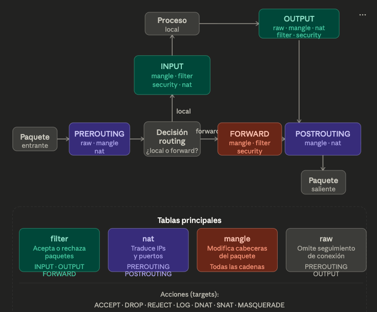

```iptables``` es el firewall por defecto en Linux. Funciona interceptando paquetes de red y aplicando reglas organizadas en tablas y cadenas. Lo más importante para entenderlo es saber cómo viaja un paquete por el sistema.



## Tablas — agrupan reglas según su propósito:

- ```filter``` — la tabla por defecto. Decide si un paquete pasa o no. Tiene las cadenas INPUT, OUTPUT y FORWARD.
- ```nat``` — traduce IPs y puertos. Se usa para compartir internet (MASQUERADE), redirigir puertos (DNAT), o enmascarar el origen (SNAT).
- ```mangle``` — modifica campos de la cabecera del paquete (TTL, TOS). Uso avanzado.
- ```raw``` — se ejecuta antes del seguimiento de conexiones (conntrack). Permite saltar el rastreo para mejorar rendimiento.

## Cadenas — puntos del camino donde se evalúan las reglas:

- PREROUTING — justo al entrar, antes de decidir a dónde va.
- INPUT — paquetes destinados a este mismo host.
- FORWARD — paquetes que solo pasan por aquí (el host actúa como router).
- OUTPUT — paquetes generados por procesos locales.
- POSTROUTING — justo antes de salir por la interfaz de red.

## Acciones (targets) — qué hacer con el paquete al hacer match:

| Target | Efecto |
|---|---|
| `ACCEPT` | Dejar pasar |
| `DROP` | Tirar silenciosamente |
| `REJECT` | Rechazar y notificar al origen |
| `LOG` | Registrar en syslog |
| `DNAT` | Cambiar IP/puerto destino |
| `SNAT` | Cambiar IP/puerto origen |
| `MASQUERADE` | SNAT dinámico (ideal para IP dinámica) |

## Orden de evaluación

Las reglas se evalúan de arriba hacia abajo. En cuanto una regla hace match, se ejecuta su target y se deja de evaluar el resto (a menos que el target sea `LOG`, que continúa). Por eso el orden importa mucho: las reglas más específicas deben ir antes que las generales.

Una política por defecto (`-P`) define qué pasa si ninguna regla hace match. La práctica segura es DROP por defecto y solo permitir lo necesario explícitamente.

## Comandos esenciales

Política por defecto: bloquear todo lo entrante
```bash
iptables -P INPUT DROP
iptables -P FORWARD DROP
iptables -P OUTPUT ACCEPT
```

Ver todas las reglas con números de línea
```bash
iptables -L -n -v --line-numbers
```
Ver tabla nat
```bash
iptables -t nat -L -n -v
```
Permitir SSH entrante
```bash
iptables -A INPUT -p tcp --dport 22 -j ACCEPT
```

Permitir SSH solo desde una IP específica
```bash
iptables -A INPUT -p tcp --dport 22 -s 10.0.0.5 -j ACCEPT
```

Bloquear una IP
```bash
iptables -A INPUT -s 192.168.1.100 -j DROP
```

Compartir internet (NAT para salida)
```bash
iptables -t nat -A POSTROUTING -o eth0 -j MASQUERADE
```

Redirigir puerto 80 → 8080
```bash
iptables -t nat -A PREROUTING -p tcp --dport 80 -j REDIRECT --to-port 8080
```

Permitir HTTP y HTTPS desde cualquier origen
```bash
iptables -A INPUT -p tcp -m multiport --dports 80,443 -j ACCEPT
```

Eliminar una regla (por número de línea)
```bash
iptables -D INPUT 3
```
Vaciar todas las reglas
```bash
iptables -F
```
Guardar reglas (Debian/Ubuntu)
```bash
iptables-save > /etc/iptables/rules.v4
```

Permitir conexiones ya establecidas (stateful)
```bash
iptables -A INPUT -m conntrack --ctstate ESTABLISHED,RELATED -j ACCEPT
```

Permitir loopback (indispensable)
```bash
iptables -A INPUT -i lo -j ACCEPT
```

Rechazar con notificación (mejor que DROP para depurar)
```bash
iptables -A INPUT -p tcp --dport 23 -j REJECT --reject-with tcp-reset
```

Loguear y descartar intentos sospechosos
```bash
iptables -A INPUT -p tcp --dport 3306 -j LOG --log-prefix "MySQL-attempt: "
iptables -A INPUT -p tcp --dport 3306 -j DROP
```